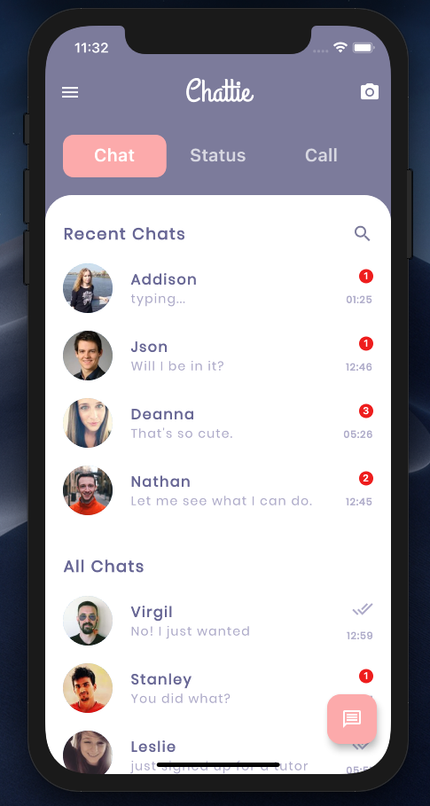
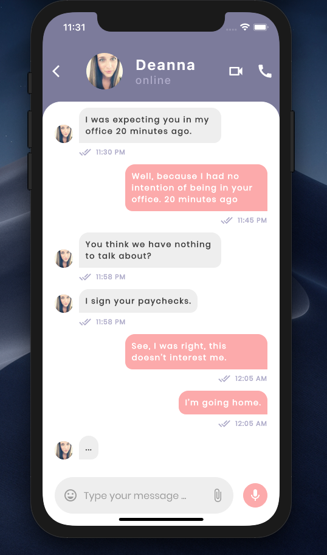

# Chat Application UI in Flutter
a chat application ui created using flutter. this application consits of two pages Homepage view with tab bar and tab barview and chat room page.

Watch this ui build process at youtube: [https://www.youtube.com/watch?v=WgJ6TzNswEo]

# 📷 ScreenShots
| HomeScreen                      | Chat Room Screen
--------------------------------- | ---------------------------------
 | 
 |

